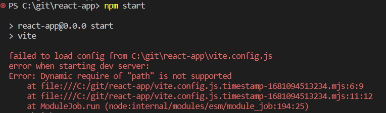
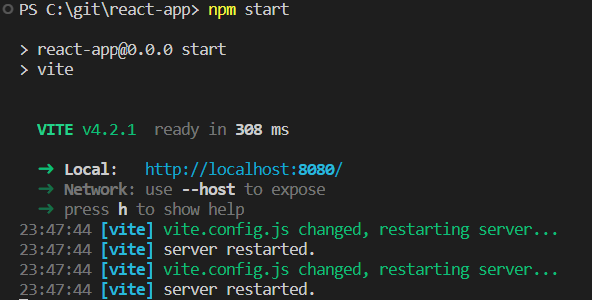

## Configuração do Boostrap com vite

Na configuração do vite.config.js, temos o seguinte código:

```js
const path = require('path')
```

No package.json adicionamos no no script: 

```js
"start": "vite"
```

Após executar o npm start:



Error: Dynamic require of "path" is not supported


[Correção](https://github.com/Subwaytime/vite-aliases/issues/33#issuecomment-1096499755): Remover o _"type":"module"_


Executar o npm start novamente:


